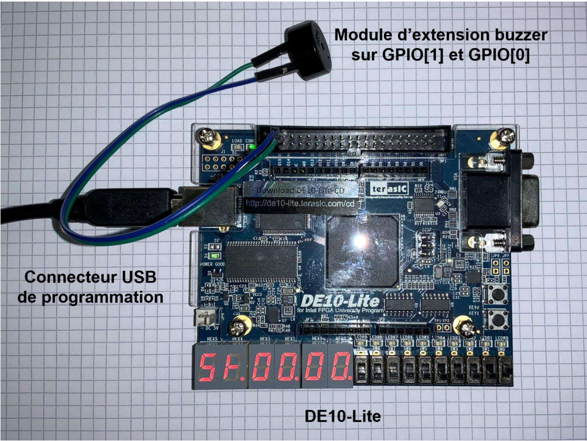
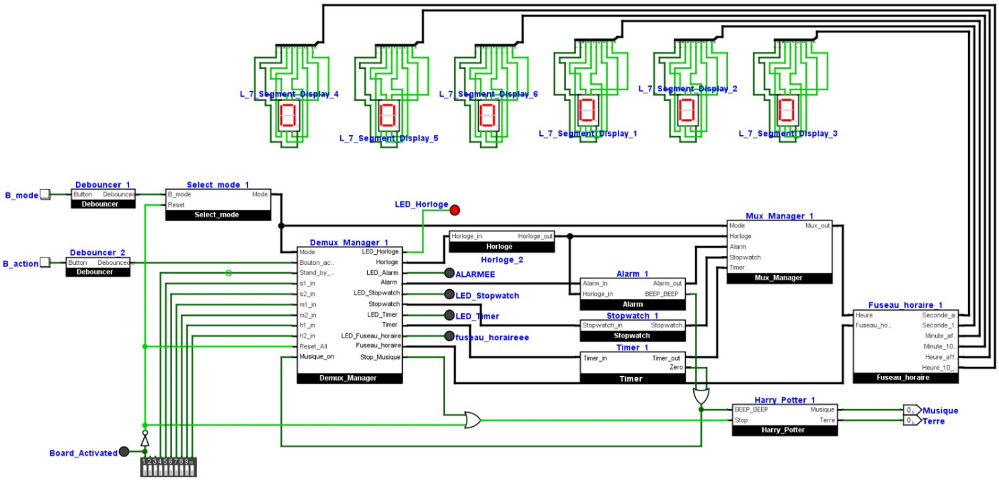

# logic-watch

This repository has been created for the project of the course "Logic system" with <a href="https://people.epfl.ch/alexandre.schmid">Prof. Alexandre Schmid</a> in BA3. The purpose of the project create a digital watch using the board DE10-Lite with a peripheral buzzer. The system has been designed only using logic gates with the software <a href="https://github.com/logisim-evolution/logisim-evolution"> logisim evolution</a>. 

  

## System description 

For this project, we have developed a device that can display the time, time zones, sound the alarm, and have a stopwatch mode as well as a timer mode. The circuit can be found in the image below.

  

## Presentation video

The presentation of this project can be found <a href="https://youtu.be/Nt_p1-IWtGc">here</a>.
